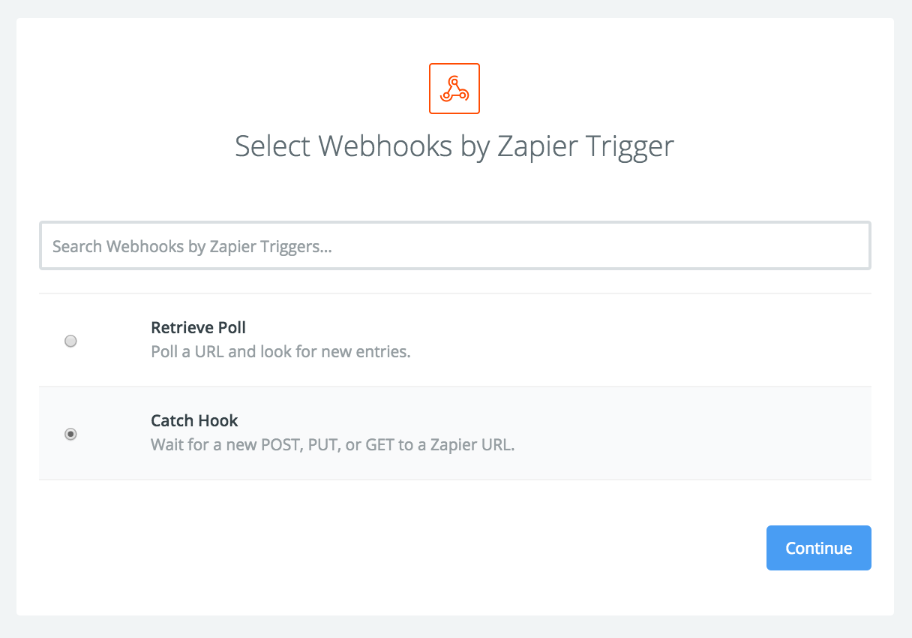
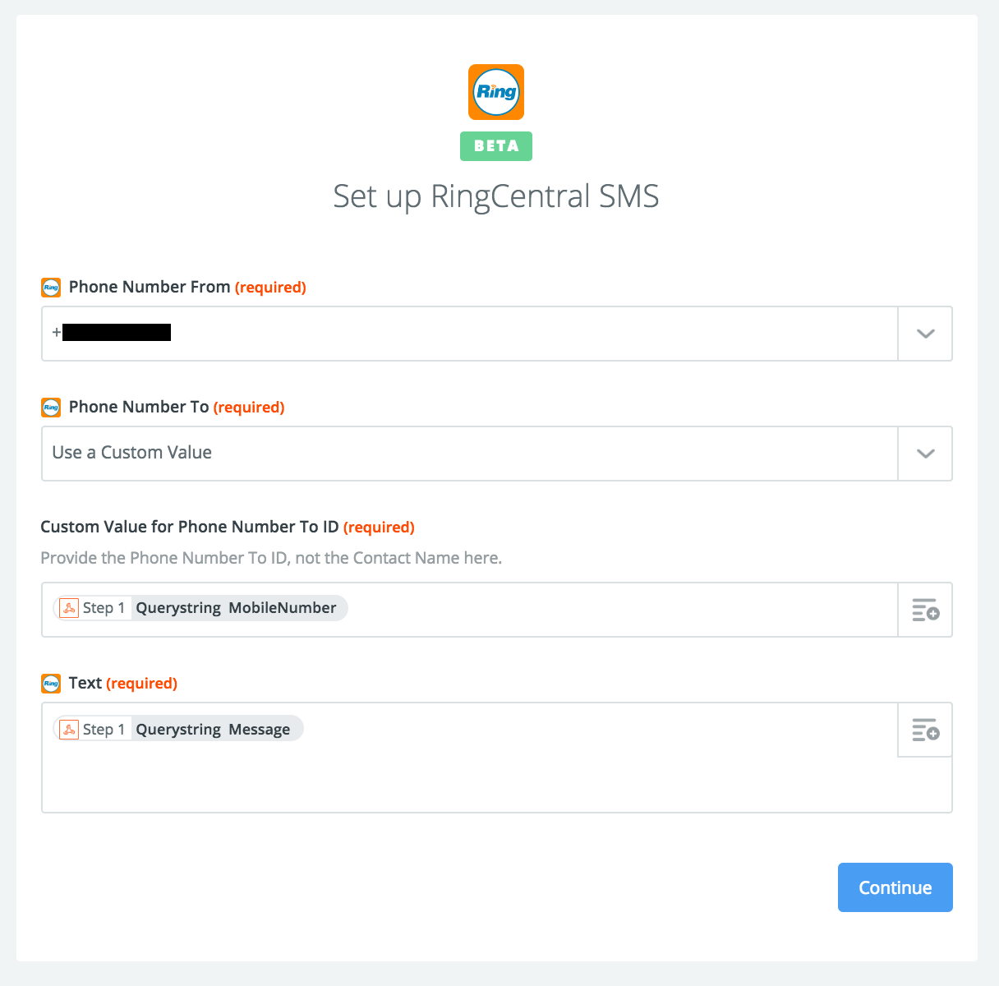

# ManageEngine ADSelfService Password Reset via SMS

[ManageEngine](https://www.manageengine.com) [ADSelfService](https://www.manageengine.com/products/self-service-password/) has a password reset feature that can utilize SMS for Two-Factor Authentication. This document describes how to integrate this service with [RingCentral APIs](https://developer.ringcentral.com/).

References:

1. [ManageEngine ADSelfService SMS Password Reset](https://www.manageengine.com/products/self-service-password/sms-email-user-id-authentication.html)
1. [ManageEngine Administration Guide](https://www.manageengine.com/products/self-service-password/help/admin-guide/Admin/server-settings/sms-server-settings.html)
1. [RingCentral Developer Guide](https://developer.ringcentral.com/api-docs/latest/index.html#!#RefSMSMessages.html)
1. [RingCentral Developer Community Thread with ASP.NET example code](https://devcommunity.ringcentral.com/ringcentraldev/topics/is-authorization-always-needed-for-sending-sms-messages)

## Integration Overview

ManageEngine interfaces with third-party SMS providers using a query-string based outbound webhook API call. This is not compatible with the RingCentral API which uses a different JSON body-based API. Basically, ManageEngine can send an outbound webhook via a `HTTP` `GET` or `POST` call with query string parameters and RingCentral listens for an authorized JSON body request.

To get these two services to integrate, 2 approaches are available:

1. Custom Middleware: Write a small service that will listen for ManageEngine GET or POST calls and format to the appropriate RingCentral SMS API call.
2. Zapier with Inbound Webhook: RingCentral has a [Zapier](https://zapier.com) integration that can be integrated with ManageEngine using the [Webhooks by Zapier](https://zapier.com/zapbook/webhook/) trigger.

The two services that need to be connected are described below:

1. [ManageEngine outbound webhook](https://www.manageengine.com/products/self-service-password/help/admin-guide/Admin/server-settings/sms-server-settings.html)
2. [RingCentral SMS API](https://developer.ringcentral.com/api-docs/latest/index.html#!#RefSMSMessages.html)

## Integration via Custom Middleware

To write a custom middleware service, you will need to operate a HTTP service which can be ASP.NET, PHP, or any other HTTP service.

Essentially two steps are necessary:

### 1) ManageEngine SMS Compatible Endpoint

ManageEngine uses a query string format of the following type in the [ManageEngine Administration Guide](https://www.manageengine.com/products/self-service-password/help/admin-guide/Admin/server-settings/sms-server-settings.html):

`userName=xxx&password=yyy&mobileNumber=%mobNo%&message=%message%`

For RingCentral, the most important parts are the mobile number and the message which are used in the RingCentral API call. An example endpoint for your server can be:

`http://localhost/rcsendsms?mobileNumber=%mobNo%&message=%message`

### 2) Making the RingCentral API Call

The `rcsendsms` code needs format the incoming query string data to use the RingCentral SMS API. When the `rcsendsms` script receives the request, it should reformat it and send it to the RingCentral API using the mobile number as the `to.phoneNumber` JSON body value and the message as the `text` JSON body value as specified in the [RingCentral API Developer Guide](https://developer.ringcentral.com/api-docs/latest/index.html#!#RefSMSMessages.html).

For authorization, the RingCentral extension credentials can be a stored using the OAuth 2.0 password grant available for private apps. If this service is behind your firewall and you are confident in your security, this may be all that you need. If you wish to lock down this service you can add your own password or key and send that as a header so that it's not captured in server logs.

While all RingCentral SDKs will automatically handle refresh tokens for you, if you do not wish to manage OAuth 2.0 refresh tokens, you can set the `refresh_token_ttl` value to `-1` so no refresh token is created for the request and then you can request a new access token for each request. Requesting a new refresh token for each SMS API call may get your app blocked by RingCentral so be sensitive to this.

## Integration via Zapier

To set up ManageEngine ADSelfService using HTTP-based Custom SMS Provider with RingCentral via Zapier, perform the following steps.

Note: for the Zapier integration to work the phone number produced by the ManageEngine `%mobNo%` macro must match a format recognized by RingCentral, e.g. E.164 format with or without the leading `+`, for example, `+1 (650) 111-2222` would be represented as `16501112222` or `+16501112222`. ManageEngine uses the formatting used in Active Directory.

### 1) Make a Zap!

Login to [Zapier](https://zapier.com) and click the `MAKE A ZAP!` button.

### 2) Set up the ManageEngine Webhook Trigger

1. Select the `Webhooks by Zapier` app.
1. Select `Catch Hook: Wait for a new POST, PUT, or GET to a Zapier URL.` for the action.
1. Click `Continue` on the Set up page, and do not enter anything in the `Pick off a Child Key` option.
1. Use the webhook provided and send a `GET` request matching the one ManageEngine will provide, e.g. `https://zapier.com/hooks/catch/111111/222222/`. It is important to use a `GET` request because Zapier does not make query string parameters available to `POST` webhooks.
1. Upon a successful test, optionally click the `view your hook` link to see the parameters you posted. If your ManageEngine URL used a template like `?mobileNumber=%mobNo%&message=%message` in Zapier you should see the `querystring__mobileNumber` and `querystring__message` parameters. Then click `Continue`.

### 3) Set up the RingCentral SMS Action

1. Select `RingCentral` for the Zapier app.
2. Select `Send SMS` for the action.
3. Select a connected RingCentral account, either an existing one or a new one via `Connect a New Account`.
4. On the `Set up RingCentral SMS` form: for the `Phone Number From`, select your login phone number or a different one that is allowed to send SMS. For the `Phone Number To` value, select `Use a Custom Value` and then in the `Custom Value for Phone Numbrer to ID` input, click the text `+` icon to the right and select `Querystring Mobile Number`. In the `Text` field, click the text `+` icon and selec the `Querystring Message` property. Then click `Continue`.
5. Optionally run the test to receive a SMS message and then click the `Finish` if you do not wish to add any additional actions.

### Select Screenshots

Selecting the Webhook Action:

Formatting the RingCentral API Call:

